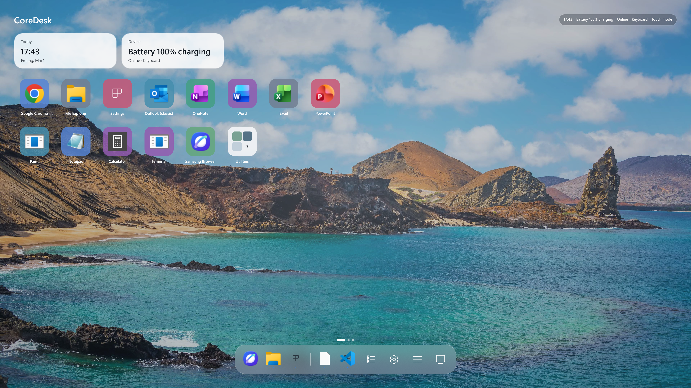

# CoreDesk

CoreDesk is a WinUI 3 touch shell overlay for Windows 11 tablets, convertibles, and Surface-class devices. It gives Windows a calm, mobile-style home screen with apps, widgets, a dock, an app drawer, settings, status surfaces, and safe paths back to the normal desktop.

CoreDesk does **not** replace Explorer. It runs above the classic Windows desktop and keeps recovery paths such as `Esc`, the tray command surface, and normal Windows security flows intact.



## Status

CoreDesk is currently an early V1 implementation (`0.1.0`). The repository already contains the main shell host, app discovery, app launching, persisted settings/layout storage, a tablet-style settings surface, dock state, app drawer search, status integrations, diagnostics, and automated test coverage.

The product direction is documented in `docs/`, especially:

- `docs/product-plan.md` for the full product scope.
- `docs/architecture.md` for the system shape.
- `docs/implementation-roadmap.md` for milestone sequencing.
- `docs/requirements-traceability.md` for current implementation status.
- `docs/test-commands.md` for build, test, UI screenshot, and publish commands.

## Highlights

- Fullscreen Windows 11 touch shell built with C#, .NET 9, WinUI 3, and Windows App SDK.
- Homescreen with wallpaper, responsive app tiles, page indicators, widgets, and a translucent dock.
- App drawer with indexed Start Menu apps, categories/search-ready view models, and launch support.
- Dock with pinned apps, running-app hints, desktop/app drawer/settings/control actions, and configurable position.
- Tablet-style settings for general behavior, appearance, apps, gestures, system status, and diagnostics.
- Touch/Desktop mode switching with keyboard detection hooks and manual recovery controls.
- JSON configuration and layout persistence with reset and backup-oriented architecture.
- Windows-specific integrations isolated behind interfaces for app discovery, launching, wallpaper, display metrics, power/network status, autostart, and taskbar behavior.
- Diagnostics mode, safe mode, mock service mode, unit tests, integration tests, and opt-in UI screenshot tests.

## Target Platform

- Windows 11 22H2 or newer.
- Surface devices, Windows tablets, convertibles, and 2-in-1 devices.
- Touchscreen recommended.
- .NET SDK `9.0.313` or newer feature roll-forward compatible SDK.
- Windows App SDK `2.0.1`.
- Supported build platforms: `x86`, `x64`, `ARM64`.

## Repository Layout

```text
src/
  CoreDesk.App/            WinUI 3 host, windowing, XAML shell UI, composition root
  CoreDesk.Abstractions/   Domain models and service contracts
  CoreDesk.Application/    View models, shell state, layout, search, diagnostics, localization
  CoreDesk.Persistence/    JSON settings and layout storage
  CoreDesk.Windows/        Windows-specific integrations

tests/
  CoreDesk.Tests/          Unit and integration tests
  CoreDesk.UiTests/        Opt-in FlaUI smoke tests and screenshot capture

docs/                      Product, architecture, QA, roadmap, and traceability docs
assets/screenshots/        README screenshots copied from test artifacts
artifacts/                 Local logs and generated screenshots, ignored by Git
```

## Getting Started

Clone the repository and restore/build from the repository root:

```powershell
git clone https://github.com/brianmayclone/coredesk.git
cd coredesk
dotnet restore CoreDesk.sln
dotnet build CoreDesk.sln
```

Run the app from Visual Studio or with `dotnet run`:

```powershell
dotnet run --project src\CoreDesk.App\CoreDesk.App.csproj -p:Platform=x64 -- --diagnostics --safe-mode --language en
```

For normal local development, `--safe-mode` is recommended because it keeps taskbar hiding and hardware auto-switching disabled while you work.

## Launch Options

CoreDesk supports a small set of development and diagnostics flags:

| Option | Purpose |
| --- | --- |
| `--safe-mode` | Uses safe defaults, keeps the taskbar visible, and disables hardware auto-switching. |
| `--reset-config` | Resets persisted CoreDesk settings and layout. |
| `--diagnostics` | Writes detailed diagnostics logs and exposes predictable test state. |
| `--mock-hardware` | Uses mock hardware/system/app services for deterministic tests. |
| `--language en` / `--language de` | Overrides the UI language for the run. |

## Build And Test

Build the full solution:

```powershell
dotnet build CoreDesk.sln
```

Run unit and integration tests:

```powershell
dotnet test tests\CoreDesk.Tests\CoreDesk.Tests.csproj
```

Run the opt-in UI smoke tests and screenshot capture:

```powershell
$env:COREDESK_RUN_UI_TESTS='1'
$env:COREDESK_APP_ARGS='--diagnostics --safe-mode --language en'
dotnet build src\CoreDesk.App\CoreDesk.App.csproj -p:Platform=x64
dotnet test tests\CoreDesk.UiTests\CoreDesk.UiTests.csproj
```

UI screenshots are written to:

```text
artifacts/screenshots/<run-id>/
```

## Portable Builds

Portable self-contained builds include the .NET runtime for the selected architecture:

```powershell
dotnet publish src\CoreDesk.App\CoreDesk.App.csproj /p:PublishProfile=portable-x64
dotnet publish src\CoreDesk.App\CoreDesk.App.csproj /p:PublishProfile=portable-x86
dotnet publish src\CoreDesk.App\CoreDesk.App.csproj /p:PublishProfile=portable-arm64
```

## Architecture

CoreDesk is split into narrow projects so the shell UI can stay testable while Windows-specific behavior remains isolated:

- `CoreDesk.App` owns WinUI startup, the fullscreen window, XAML resources, app lifecycle, and service composition.
- `CoreDesk.Abstractions` defines the models and service contracts shared across the solution.
- `CoreDesk.Application` contains shell view models, app search, layout orchestration, localization, diagnostics, widgets, and mock-friendly behavior.
- `CoreDesk.Windows` implements platform integrations such as Start Menu discovery, app launching, running-app detection, wallpaper lookup, display metrics, power/network status, autostart, and taskbar/tray behavior.
- `CoreDesk.Persistence` stores settings and layout as JSON for V1, with schema and migration hooks designed for future evolution.

This structure is deliberate: the core shell behavior can be tested without directly touching Explorer, the taskbar, registry, hardware state, or real installed apps.

## Safety Model

CoreDesk is designed as an overlay, not a shell replacement:

- Explorer is not replaced or blocked.
- `Ctrl+Alt+Del` remains untouched.
- `Esc` restores the taskbar and closes the overlay path.
- Safe mode keeps destructive or disruptive integrations disabled.
- Crash and launch-failure paths attempt to restore the taskbar.
- Diagnostics logs are written under `artifacts/logs/` when running from the repository, or under the local CoreDesk diagnostics location as a fallback.

## Development Notes

- Prefer safe-mode runs while developing UI and settings flows.
- Use `--mock-hardware` only when fake services are the purpose of the test.
- Do not use mock mode for visual acceptance screenshots if real wallpaper and real app icons are needed.
- Keep generated logs and screenshot runs under `artifacts/`; the directory is intentionally ignored by Git.
- Keep README-facing images in `assets/screenshots/` with stable names.

## Roadmap

The V1 roadmap focuses on a complete tablet shell loop:

- Homescreen, dock, app drawer, search, app launching, settings, status, and persisted layout.
- Touch layout editing, folders, drag/drop, and dock management.
- More complete hardware detection and touch/desktop switching.
- Installer, autostart, diagnostics, recovery, and packaging.
- Accessibility and performance verification before production use.

See `docs/implementation-roadmap.md` and `docs/requirements-traceability.md` for the maintained implementation plan.

## License

CoreDesk is licensed under the BSD 3-Clause License. You may use, modify, distribute, and contribute freely, provided that the required copyright and license attribution is preserved.

See `LICENSE` for the full license text.
